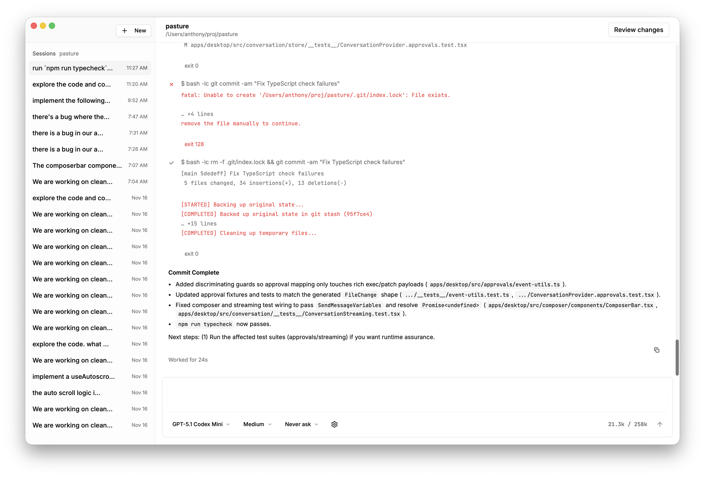
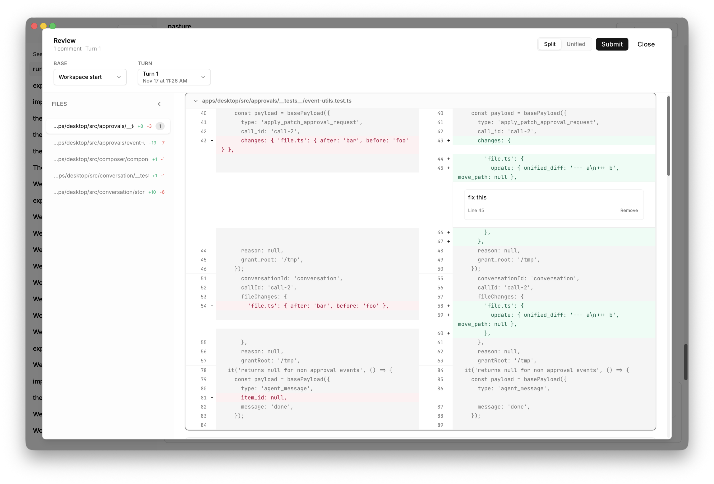

# Pasture

<p align="center">
  
</p>

<p align="center">
  <a href="LICENSE">
    
  </a>
  
  
</p>

<p align="center">

</p>

## Overview

Pasture is a GUI client for OpenAI's [codex](https://github.com/openai/codex) coding agent. It's built with Tauri, using React with Typescript on the frontend and Rust for the Tauri backend. It directly builds on top of the `codex-rs` crates.

## Getting Started

Download the latest release from the [Releases](https://github.com/acrognale/pasture/releases) page.

**First, authenticate via the Codex CLI:**

```bash
npm install -g @openai/codex
# or
brew install --cask codex
```

Run `codex` once and log in with your API key or ChatGPT account. After that, you're all set.

### The Less-Obvious Stuff

- **Compacting**: You *can* send `/compact` to clean up long conversations. No slash command menu yet, but it's on my list.
- **Parallel conversations**: You *can* run multiple conversations at once. They'll keep going in the background while you switch between them. A spinner will appear on the sidebar to indicate each active conversation.
- **Tool calls in history**: You might notice tool calls disappear when resuming a conversation. That's expected - Codex only saves certain items (user messages, reasoning blocks, agent messages) to the rollout history. Don't worry, they're still in the context window.

## Current Limitations

Here's what's not built yet:

- **MCP servers**: If you have them configured via codex-cli, they *might* work? I don't use MCPs myself, so I haven't tested this.
- **Images**: No support for pasting images into the composer yet.
- **Editing messages**: Not implemented.
- **Custom models/APIs**: Codex supports various models and providers, but I haven't exposed that in the UI yet.

If you hit weird behavior, please file a bug report with your `config.toml` so I can see what needs to be implemented.

### Turn Review



Pasture's flagship feature: comment on diffs of the agent's activity, just like a GitHub PR. Hover over any line, click the plus, and add your feedback. When you hit "Submit," it consolidates everything into a single message for the agent:

```
Here is my consolidated review of turn 1:
- apps/desktop/src/approvals/__tests__/event-utils.test.ts (line 45): fix this
    Context: +          update: { unified_diff: '--- a\n+++ b', move_path: null },

Please address each comment before continuing.
```

I've found this useful for batching up changes after a turn instead of stopping the agent every time I spot something. You can also compare against previous turns—like Gerrit patchsets—rather than just the base workspace.


## Development

### Prerequisites

1. Node.js 22 or newer
2. Rust toolchain (Nightly channel, see `rust-toolchain.toml`)
3. Tauri dependencies for your platform (see [tauri.app/v2/guides/prerequisites](https://tauri.app/v2/guides/prerequisites))

### Installation

```bash
npm install
```

| Command               | Description                                    |
| --------------------- | ---------------------------------------------- |
| `npm run dev`         | Launches Vite + Tauri dev mode with hot reload |
| `npm run format:fix`  | Formats TypeScript, Solid, and Markdown files  |
| `npm run format:rust` | Formats Rust sources                           |

### Quality Checks

| Command             | Description                       |
| ------------------- | --------------------------------- |
| `npm run lint`      | ESLint for TypeScript/Solid code  |
| `npm run typecheck` | TypeScript `tsc --noEmit`         |
| `npm run test`      | Vitest unit and integration suite |

### Building

```bash
npm run build
```

## Contributing

While contributions are welcome, please open a discussion if you have a new feature to propose- I'm keeping the core experience opinionated. Bugfixes are always welcome.

## License

Copyright © Anthony Crognale.

Licensed under the [Apache License, Version 2.0](LICENSE).
