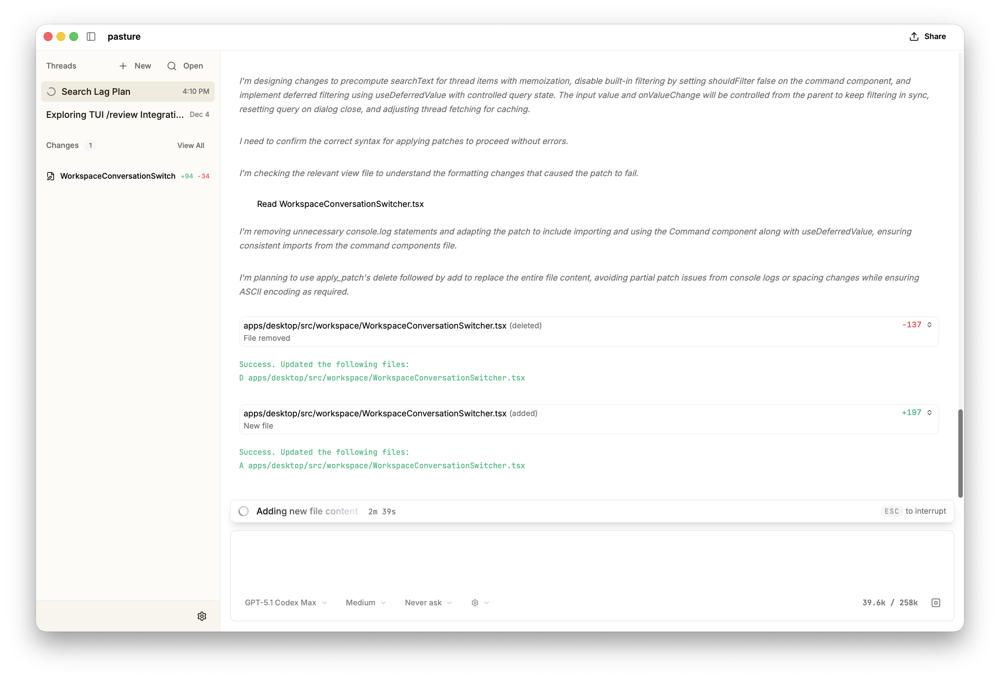
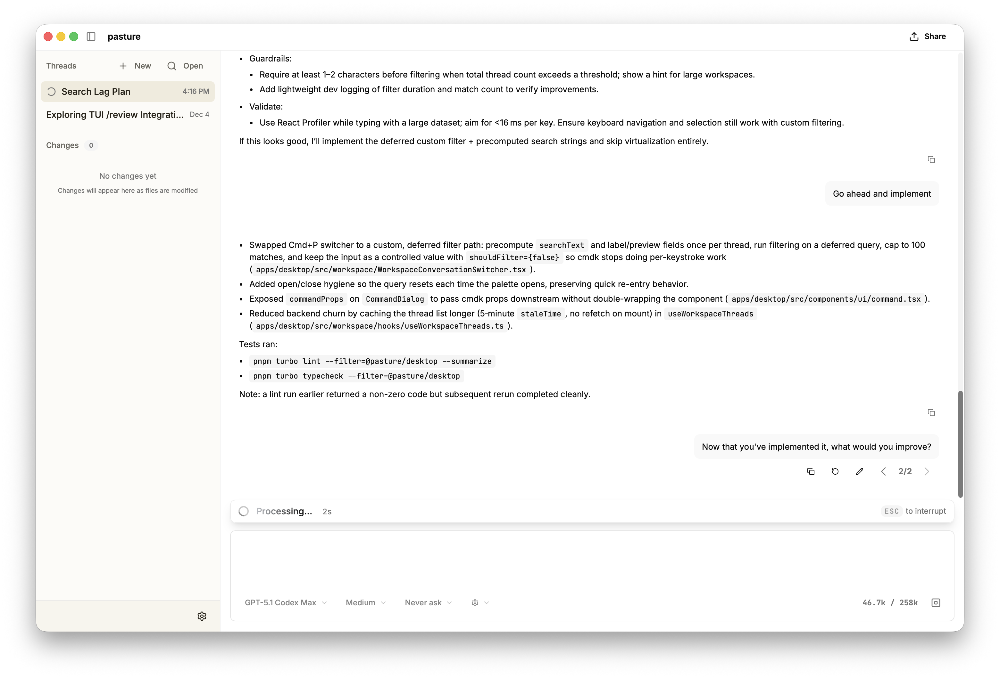
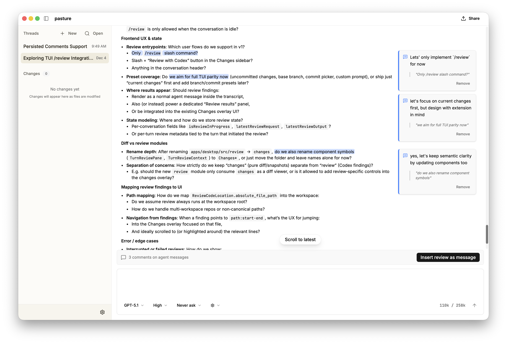
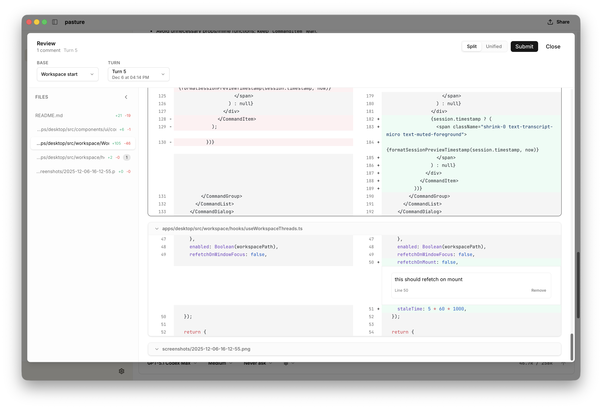
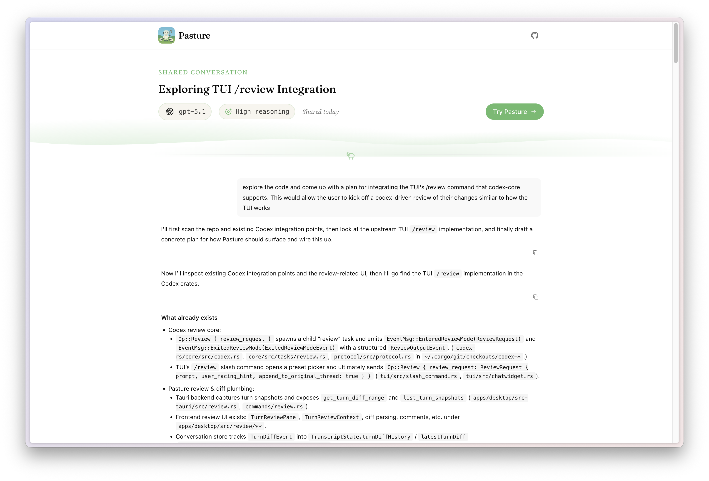

# Pasture

<p align="center">
  
</p>

<p align="center">
  <a href="LICENSE">
    
  </a>
  
  
</p>

<p align="center">

</p>

## Overview

Pasture is a GUI for Codex built for developers who want more control than a TUI. Branch conversations, annotate message/code output like a PR, and use Handoff and Read Thread to keep threads short and focused.

## Getting Started

Download the latest release from the [Releases](https://github.com/acrognale/pasture/releases) page.

**First, authenticate via the Codex CLI:**

```bash
npm install -g @openai/codex
# or
brew install --cask codex
```

Run `codex` once and log in with your API key or ChatGPT account. After that, you're all set.

## Key Features

### Message Editing & Conversation Branching

Edit any message to fork the conversation into a new branch. Pasture maintains a tree of conversation versions, letting you explore different approaches without losing the previous conversation. Use the version selector below each edited message to navigate between branches.



### Comment on Messages

The GPT-5.* family of models produce excellent plans. Often times, these plans are very long- which I've found frustrating to construct replies to in order to provide feedback and further steer the plan. 

Pasture allows you to highlight portions of a response and add comments. This let's you build up a larger "feedback message". Clicking `Insert review as message` provides you with a formatted message such as,

```
I have a few comments on your previous response:
- Message snippet: "..."
  Comment 1: "..."
- Message snippet: "..."
  Comment 2: "..."

Please address each comment before continuing.
```



### Comment on Files

Comment on diffs of the agent's activity, just like a GitHub PR. Hover over any line, click the plus, and add your feedback. When you hit "Submit", it consolidates everything into a single message for the agent:

```
Here is my consolidated review of turn 1:
- apps/desktop/src/approvals/__tests__/event-utils.test.ts (line 45): fix this
    Context: +          update: { unified_diff: '--- a\n+++ b', move_path: null },

Please address each comment before continuing.
```

I've found this useful for batching up changes after a turn instead of stopping the agent every time I spot something. You can also compare against previous turns—like Gerrit patchsets—rather than just the base workspace.



### Handoff

Modeled after [Amp's handoff feature](https://ampcode.com/news/handoff), `/handoff` extracts the relevant context from the current thread based on your goal for the next thread. Under the hood, it uses the latest GPT-5.x model to produce a prompt and pre-fill the composer with it in the new thread, so that you can review and edit it before sending- just like in Amp.

### `read_thread` Tool

Pasture's fork of Codex adds a `read_thread` tool modeled again after [Amp's version of it](https://ampcode.com/news/read-threads). This tool allows the agent to ask questions about the referenced thread- allowing it to pull additional context it needs. It pairs excellently with the `/handoff` feature.

### Sharing

Click "Share" in the top bar to generate a public link (`https://pasture.dev/s/$id`) of your transcript. The web viewer includes the full conversation, code diffs, and rich OpenGraph metadata for clean previews on social platforms.



### Keyboard Shortcuts

| Shortcut                      | Action                                 |
|-------------------------------|----------------------------------------|
| `⌘B`                          | Toggle workspace sidebar               |
| `⌘N`                          | New thread                             |
| `⌘P`                          | Open thread switcher                   |
| `Ctrl+Tab` / `Ctrl+Shift+Tab` | Cycle recent conversations             |
| `⌘,`                          | Open workspace settings                |
| `⌘K`                          | Toggle developer command menu          |
| `Esc`                         | Interrupt active turn / close overlays |

## Nice-to-Knows

- **Generated session titles**: Pasture generates titles based on your first user message, but only if no title exists.
- **Session management**: The sidebar only displays active/loaded sessions. Resume previous sessions via "Open" or `⌘P`. Use `Ctrl+Tab` for a recent‑conversation switcher overlay.
- **Queued messages**: Start a new prompt while a turn is running—it queues automatically. Review or cancel queued messages in the status indicator.
- **Images in transcript**: Pasted images appear as attachments in the composer and render as `view-image` tool cells in the transcript with full metadata.
- **Auto‑updates**: Pasture checks for updates on startup and via the native menu, with an in‑app dialog for seamless upgrades.

### Codex behavior differences in our fork

In addition to adding some new tasks and tools, here's a running a list of the behavioral changes in our fork of Codex:

- The rollout recorder persists many more event types. This allows resumed sessions to display changed files and see the output of commands / patches in the transcript.

## Current Limitations

Here's what's not built yet:

- **MCP server configuration**: While there's no UI for it in Pasture, adding them to your Codex config.toml should let you use MCP servers. 
- **Custom models/APIs**: Codex supports various models and providers, but I haven't exposed that in the UI yet.

If you hit weird behavior, please file a bug report with your `config.toml` so I can see what needs to be implemented.

## Development

### Prerequisites

1. Node.js 22 or newer
2. Rust toolchain (Nightly channel, see `rust-toolchain.toml`)
3. Tauri dependencies for your platform (see [tauri.app/v2/guides/prerequisites](https://tauri.app/v2/guides/prerequisites))

### Installation

```bash
npm install
```

### Development Commands

| Command                | Description                                    |
|------------------------|------------------------------------------------|
| `pnpm run dev`         | Launches Vite + Tauri dev mode with hot reload |
| `pnpm run dev:web`     | Runs only the web viewer                       |
| `pnpm run build`       | Builds production desktop app                  |
| `pnpm run package`     | Creates distributable packages                 |
| `pnpm run format:fix`  | Formats TypeScript, React, and Markdown        |
| `pnpm run format:rust` | Formats Rust sources                           |
| `pnpm run lint`        | ESLint for TypeScript/React                    |
| `pnpm run typecheck`   | TypeScript compilation check                   |
| `pnpm run test`        | Vitest unit and integration suite              |


## Contributing

While contributions are welcome, please open a discussion for new features—I'm keeping the core experience opinionated. Bugfixes are always welcome.


## License

Copyright © Anthony Crognale.

Licensed under the [Apache License, Version 2.0](LICENSE).

